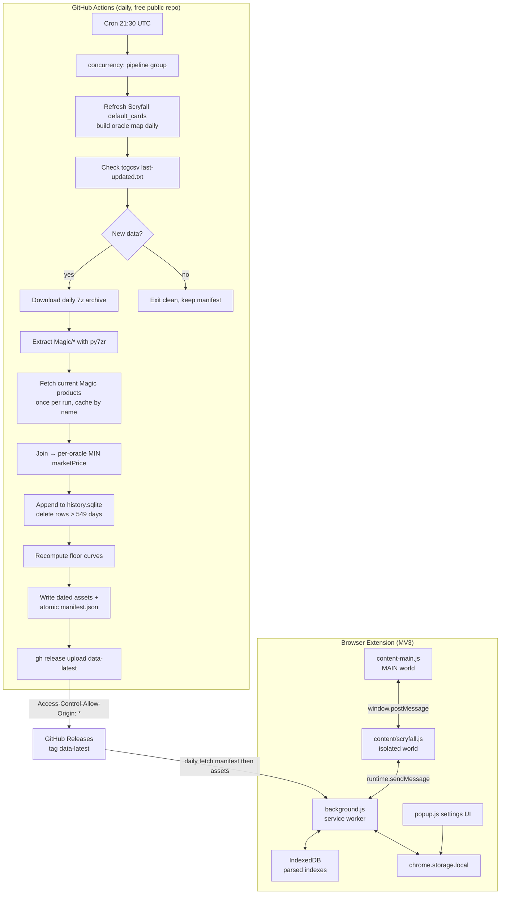

# Dollar Commander Implementation Plan

This plan operationalizes the research in [tcgcsv-research.md](./tcgcsv-research.md). It supersedes the prior plan after a rubber-duck critique surfaced several correctness issues; the changes from the first revision are listed at the end of this document.

---

## 1. Scope and key decisions

### What the extension does

For every Magic: The Gathering card displayed on Moxfield, Archidekt, or Scryfall, evaluate whether the card has been **available at or below a user-configured USD threshold sometime in the last 365 days**, considering any printing/finish of that card. Render a small badge: legal / warning / illegal, with a tooltip.

### Configurable threshold

The threshold is a user preference (default $1.00) stored in `chrome.storage.local`, capped at $25 for the MVP. Lookback window is fixed at 365 days; rotation grace is 184 days (Jan/Jul cutoffs). The published data must support correct legality and aging-state computation for **any** threshold in the supported range.

### Aggregation rule (explicit, after critique)

> For each Scryfall `oracle_id` on date `D`, the price is `MIN(marketPrice)` over **every** TCGCSV row (Normal `subTypeName` and Foil `subTypeName`) whose `productId` maps via Scryfall's `tcgplayer_id` or `tcgplayer_etched_id` to that `oracle_id`, after exclusions.

This is the literal "lowest market price you could have paid for any physical copy of the card on that day," intentionally including foils. A user buying the cheapest available copy doesn't care whether it's foil. This is consistent with the user's original wording (*"lowest price you could get any version of Disenchant"*) and with how community discussions treat the rule. The earlier plan equivocated between this and "non-foil primary" — that ambiguity is removed.

### Data format: sparse price-floor curve (changed from prior plan)

For each oracle_id, publish:

```jsonc
{
  "today": 1.32,
  "min_549": 0.18,
  "first_seen": "2025-04-12",
  "floor": [
    [0.18, "2026-03-14"],
    [0.55, "2026-04-30"],
    [1.30, "2026-05-22"]
  ]
}
```

- `floor` is sorted ascending by price.
- For threshold `T`, look up the highest entry whose price ≤ `T`: its date is "the most recent date the card was at or below `T`."
- The curve is the *Pareto frontier of (price, date)* — only points that are not dominated by a later cheaper observation. In practice this is 3–15 entries per card and compresses extremely well.

This makes warning/aging/rotation states **correct for any threshold**, not approximate.

Per-card record size: median ~120 bytes, p99 ~400 bytes. With ~30k oracle_ids:
- Raw JSON: ~5 MB
- gzipped: ~1.0–1.5 MB

### Lookback / rotation window

The published index covers **549 days** (365 lookback + 184 rotation grace), so that a card scheduled to rotate at the next Jan/Jul cutoff still has a `floor` entry within the published window. After 549 days of being above threshold, the card is unambiguously illegal.

### Distribution

A versioned **manifest** is fetched first:

```jsonc
// manifest.json
{
  "data_version": "2026-05-24",
  "schema_version": { "major": 1, "minor": 0 },
  "generated_at": "2026-05-24T21:32:11Z",
  "as_of_date": "2026-05-24",
  "history_start_date": "2024-11-22",
  "metric": "marketPrice",
  "lookback_days": 365,
  "rotation_grace_days": 184,
  "card_count": 24987,
  "assets": {
    "price_index": { "url": "...price-index-2026-05-24.json",   "sha256": "...", "size": 5012345 },
    "card_index":  { "url": "...card-index-2026-05-24.json",    "sha256": "...", "size": 1820000 }
  }
}
```

Each daily run uploads **dated** asset filenames and rewrites only the manifest atomically (which is a single small file, last in the upload order). Clients that fetch manifest → asset see a consistent snapshot.

Files are served as **plain JSON** (not `.json.gz`) so `Response.json()` works without bespoke decompression. GitHub's CDN advertises `Content-Encoding: gzip` automatically for compressible content types via Accept-Encoding negotiation, so transport size is similar to publishing pre-gzipped files.

### URL pattern (changed)

```text
https://github.com/natefinch/dollar-commander/releases/download/data-latest/manifest.json
```

This uses the **tag-specific** download URL, not `releases/latest/download/...`. The tag `data-latest` is reserved for the data pipeline; extension releases use separate tags (`v0.1.0` etc.) and cannot accidentally shadow data assets.

### MVP scope (changed)

Ship Scryfall integration only for MVP. Scryfall's card pages embed `oracle_id` in their data model and are the lowest-risk extraction target. Moxfield and Archidekt come in a follow-up phase once the pipeline + extension scaffolding is proven end-to-end. This significantly reduces surface area and gets a usable product into our hands sooner.

### Repo organization

A single repo. Pipeline scripts live under `scripts/pipeline/`. The pipeline is in **Python** because `py7zr` is the most stable PPMd 7z decompressor and `ijson` streams the 514 MB Scryfall bulk file without exhausting GHA's 7 GB RAM.

---

## 2. High-level architecture



---

## 3. Repo layout (after this plan)

```
dollar-commander/
├── .github/
│   ├── copilot-instructions.md
│   └── workflows/
│       ├── daily-index.yml         # cron: 21:30 UTC, concurrency: pipeline
│       └── backfill.yml            # workflow_dispatch
├── docs/
│   ├── tcgcsv-research.md
│   ├── implementation-plan.md      # this file
│   └── data-format.md              # written in Phase 4
├── icons/
├── manifests/
├── scripts/
│   ├── sign-firefox.mjs
│   └── pipeline/
│       ├── requirements.txt        # py7zr, requests, ijson
│       ├── exclusions.py
│       ├── oracle_map.py           # build {tcgplayer_id/etched → oracle_id} maps
│       ├── ingest_day.py           # one day → SQLite delta
│       ├── backfill.py             # loop ingest_day over a range
│       ├── publish.py              # SQLite → floor-curve JSON + manifest
│       └── tests/                  # pytest
│           ├── fixtures/
│           ├── test_exclusions.py
│           ├── test_oracle_map.py
│           ├── test_ingest_day.py
│           └── test_publish.py
├── src/
│   ├── background.js
│   ├── content-main.js             # MAIN world bridge
│   ├── content/
│   │   ├── common/
│   │   │   ├── overlay.js
│   │   │   └── extract.js
│   │   └── scryfall.js             # isolated world for Scryfall
│   ├── lib/
│   │   ├── price-index.js
│   │   ├── legality.js
│   │   ├── floor-curve.js
│   │   └── settings.js
│   ├── popup.html
│   ├── popup.js
│   └── styles.css
├── tests/
│   ├── sites.test.js
│   ├── legality.test.js
│   ├── floor-curve.test.js
│   └── price-index.test.js
└── data/                           # NOT committed; .gitignored
    ├── history.sqlite
    └── scryfall-oracle-map.json
```

---

## 4. Phased work plan

Each phase has an explicit exit criteria; each phase ends with a rubber-duck review of the code by GPT-5.5.

### Phase 0 — Repo prep

**Goal:** clean baseline that still builds.

- Add `data/` to `.gitignore`.
- Move `src/content.js` → `src/content/legacy.js` (still referenced by current manifest until Phase 8 replaces it).
- Add empty `scripts/pipeline/` and `tests/` placeholders with `.gitkeep`-like stubs.
- Add `tests/legality.test.js`, `tests/floor-curve.test.js`, `tests/price-index.test.js` as `t.skip("not implemented yet")` stubs so `npm test` continues to pass.

**Exit:** `npm test` and `npm run build` succeed; manifest still loads in Chrome.

---

### Phase 1 — Pipeline: Scryfall oracle map

**Goal:** produce `data/scryfall-oracle-map.json` with two maps and a name lookup.

**Files:** `scripts/pipeline/exclusions.py`, `scripts/pipeline/oracle_map.py`, tests.

**Algorithm:**

1. `GET https://api.scryfall.com/bulk-data`, pick `type == "default_cards"`, read `download_uri` and `updated_at`.
2. Stream-parse with `ijson.items(stream, "item")` so memory stays bounded.
3. Apply exclusions (from research):
   - `card.digital`, `card.oversized`
   - `card.set_type == "memorabilia"`
   - `card.layout in {"art_series","vanguard","scheme","planar","phenomenon","token"}`
   - `card.type_line` starts with `"Emblem"`
   - For `card.layout == "reversible_card"`, use `card.card_faces[0].oracle_id`
4. Emit:

   ```json
   {
     "generated_at": "...",
     "scryfall_bulk_updated_at": "...",
     "tcgplayer_id":         { "452063": "a7e97fa9-...", "...": "..." },
     "tcgplayer_etched_id":  { "541280": "0d3a06d5-...", "...": "..." },
     "scryfall_id_to_oracle":{ "658c5caa-...": "a7e97fa9-...", "...": "..." },
     "oracle_names":         { "a7e97fa9-...": "Disenchant", "...": "..." }
   }
   ```

5. The whole file is uncompressed JSON, ~5–8 MB. We do NOT gzip it on disk (gzip happens at transport). It is regenerated **daily**; a stale map is the root cause of many silent ingestion misses.

**Tests:**

- Disenchant oracle_id `a7e97fa9-4b72-4548-b854-5be5f18a6f1a` appears in `oracle_names`.
- BRO Disenchant productId `452063` is in `tcgplayer_id`.
- MH3 Emrakul Foil Etched productId `541280` is in `tcgplayer_etched_id`, not `tcgplayer_id`.
- Some known sealed productId is absent from both maps.
- Exclusion smoke test: a known memorabilia / token card is absent from `oracle_names`.

**Exit:** map file produced reproducibly; tests pass; size < 10 MB.

---

### Phase 2 — Pipeline: per-day ingestion

**Goal:** ingest one TCGCSV daily archive into `history.sqlite`. Idempotent on rerun.

**Files:** `scripts/pipeline/ingest_day.py`, tests.

**Schema (changed to integer keys + cents):**

```sql
PRAGMA journal_mode = WAL;

CREATE TABLE IF NOT EXISTS oracle (
  id          INTEGER PRIMARY KEY,
  oracle_uuid TEXT    NOT NULL UNIQUE
) WITHOUT ROWID;

CREATE TABLE IF NOT EXISTS price_history (
  oracle_key  INTEGER NOT NULL,
  date_epoch  INTEGER NOT NULL,           -- days since 2020-01-01
  price_mils  INTEGER NOT NULL,           -- USD × 1000, so $0.187 → 187
  PRIMARY KEY (oracle_key, date_epoch)
) WITHOUT ROWID;

CREATE INDEX IF NOT EXISTS idx_phist_date ON price_history(date_epoch);
```

Using `INTEGER` for `oracle_key` + integer mils for price brings 365 × 30k rows down to ~80–100 MB, with much better B-tree fanout.

**Product metadata strategy (changed):**

Backfill **does not** refetch products per historical day. Once per pipeline run:

1. Fetch the current Magic groups list (`/tcgplayer/1/groups`).
2. For each group, fetch `/tcgplayer/1/{groupId}/products` once (with 100ms sleep), build an in-memory dict `productId → product`.
3. Reuse that dict for every historical day in the run.

Product names are stable enough across a year that this is a safe approximation — and TCGCSV does not include products inside daily price archives, only prices. Cache the products JSON between runs via `actions/cache` keyed on the date.

**Per-day flow:**

1. `GET tcgcsv.com/last-updated.txt`.
2. `GET tcgcsv.com/archive/tcgplayer/prices-YYYY-MM-DD.ppmd.7z` with `User-Agent: dollar-commander/0.1 (+https://github.com/natefinch/dollar-commander)`.
3. `py7zr` extract only `YYYY-MM-DD/1/*/prices` files.
4. For each `(productId, subTypeName)` row:
   - Skip if `marketPrice` is null/missing.
   - Look up product by `productId`. Skip if not found.
   - Skip if `product.name` matches `/\(Serial Numbered|Serialized\)/i`.
   - If `product.name` matches `/\(Foil Etched\)/i`, use `tcgplayer_etched_id` map; else `tcgplayer_id` map.
   - Skip if no oracle_id (sealed products, tokens, etc.) — but count and report `unmapped_count` for monitoring.
   - Track running `min(marketPrice)` per oracle_id for the date.
5. `INSERT OR REPLACE` one row per oracle_id into `price_history`. Convert price to mils.
6. `DELETE FROM price_history WHERE date_epoch < :today_epoch - 549`.
7. Emit a structured stdout line `INGEST_RESULT={"date":"…","rows":12345,"unmapped":42,"status":"ok"}` for the workflow to gate on.

**Status outputs (for workflow gating):**

`ingest_day.py --date YYYY-MM-DD --db …` exits **0** in all of:
- ingestion succeeded → `status=ok`
- TCGCSV not yet updated → `status=skipped`
- archive 404 (e.g., before 2024-02-08) → `status=missing`

Exits non-zero only on bugs / unexpected errors. Workflow uses the structured output to decide whether to publish.

**Tests:**

- Mock-fixture archive with a Disenchant Normal row → DB has correct (oracle_id, date, price) row.
- Foil-only printing → still produces a row (we include foils).
- Serialized product → no row produced.
- Foil Etched product → uses `tcgplayer_etched_id` lookup.
- Rerunning the same day is idempotent (no duplicate or changed rows).

**Exit:** one-day ingestion runs <60s on fixture data; status output is correct in all branches.

---

### Phase 3 — Backfill workflow

**Goal:** seed `history.sqlite` with 549 days of data on first setup.

**Files:** `scripts/pipeline/backfill.py`, `.github/workflows/backfill.yml`.

```yaml
name: Backfill price history
on:
  workflow_dispatch:
    inputs:
      start_date: { required: false, description: "YYYY-MM-DD (default: today-549)" }
      end_date:   { required: false, description: "YYYY-MM-DD (default: today)" }

concurrency:
  group: pipeline
  cancel-in-progress: false

jobs:
  backfill:
    runs-on: ubuntu-latest
    timeout-minutes: 300
    steps:
      - uses: actions/checkout@v4
      - uses: actions/setup-python@v5
        with: { python-version: "3.12" }
      - run: pip install -r scripts/pipeline/requirements.txt

      - name: Build fresh oracle map
        run: python -m scripts.pipeline.oracle_map --out data/scryfall-oracle-map.json

      - name: Fetch current Magic products (single source of truth for run)
        run: python -m scripts.pipeline.ingest_day --fetch-products-only --out data/products.json

      - name: Loop backfill
        run: |
          python -m scripts.pipeline.backfill \
            --start "${{ inputs.start_date }}" \
            --end   "${{ inputs.end_date }}" \
            --db    data/history.sqlite \
            --map   data/scryfall-oracle-map.json \
            --products data/products.json

      - name: Publish initial assets
        run: python -m scripts.pipeline.publish --db data/history.sqlite --out-dir dist/

      - name: Upload to release tag data-latest (atomic via manifest last)
        run: |
          gh release create data-latest --notes "Initial backfill" || true
          gh release upload data-latest dist/price-index-*.json dist/card-index-*.json --clobber
          gh release upload data-latest dist/manifest.json --clobber
        env: { GH_TOKEN: ${{ secrets.GITHUB_TOKEN }} }
```

**Backfill loop notes:**

- 549 iterations × ~3s each ≈ **30 minutes** wall time on GHA. Inside the 6-hour limit.
- `actions/cache` keys the products dict per date so reruns of partial backfills don't re-fetch.
- TCGCSV archives before 2024-02-08 are skipped (status `missing`) and recorded so we know our true `history_start_date`.

**Exit:** running this workflow produces `history.sqlite` with ~80–100 MB and a coherent first set of dated assets + manifest under `data-latest`.

---

### Phase 4 — Daily index workflow

**Goal:** the recurring daily pipeline that incrementally updates the published data.

**Files:** `scripts/pipeline/publish.py`, `.github/workflows/daily-index.yml`.

```yaml
name: Daily price index
on:
  schedule:
    - cron: "30 21 * * *"      # 21:30 UTC, ~90 min after TCGCSV refresh
  workflow_dispatch:

concurrency:
  group: pipeline
  cancel-in-progress: false

jobs:
  publish:
    runs-on: ubuntu-latest
    timeout-minutes: 30
    steps:
      - uses: actions/checkout@v4
      - uses: actions/setup-python@v5
        with: { python-version: "3.12" }
      - run: pip install -r scripts/pipeline/requirements.txt

      - name: Restore history.sqlite from data-latest
        run: |
          gh release download data-latest --pattern history.sqlite --dir data || \
            echo "::error::No history.sqlite in data-latest; run backfill first"; exit 1
        env: { GH_TOKEN: ${{ secrets.GITHUB_TOKEN }} }

      - name: Rebuild oracle map (daily)
        run: python -m scripts.pipeline.oracle_map --out data/scryfall-oracle-map.json

      - name: Fetch current Magic products
        run: python -m scripts.pipeline.ingest_day --fetch-products-only --out data/products.json

      - name: Ingest today
        id: ingest
        run: |
          OUT=$(python -m scripts.pipeline.ingest_day \
            --date "$(date -u +%Y-%m-%d)" \
            --db data/history.sqlite \
            --map data/scryfall-oracle-map.json \
            --products data/products.json)
          echo "$OUT"
          STATUS=$(echo "$OUT" | grep -oP 'INGEST_RESULT=\K.*' | jq -r '.status')
          echo "status=$STATUS" >> "$GITHUB_OUTPUT"

      - name: Publish if ingestion succeeded
        if: steps.ingest.outputs.status == 'ok'
        run: python -m scripts.pipeline.publish --db data/history.sqlite --out-dir dist/

      - name: Upload assets then manifest (atomic for clients)
        if: steps.ingest.outputs.status == 'ok'
        run: |
          gh release upload data-latest dist/price-index-*.json dist/card-index-*.json history.sqlite --clobber
          gh release upload data-latest dist/manifest.json --clobber
        env: { GH_TOKEN: ${{ secrets.GITHUB_TOKEN }} }
```

**`publish.py` algorithm:**

1. Compute `today_epoch`.
2. Build per-oracle floor curve with one SQL pass using a window function:

   ```sql
   WITH window_rows AS (
     SELECT oracle_key, date_epoch, price_mils
     FROM price_history
     WHERE date_epoch >= :today_epoch - :window
   ),
   -- For each oracle, take the Pareto frontier of (price, date):
   -- a point (p, d) is on the curve iff no later point (p', d') exists with p' ≤ p.
   right_min AS (
     SELECT oracle_key, date_epoch, price_mils,
            MIN(price_mils) OVER (
              PARTITION BY oracle_key
              ORDER BY date_epoch DESC
              ROWS BETWEEN CURRENT ROW AND UNBOUNDED FOLLOWING
            ) AS min_after
     FROM window_rows
   ),
   floor_points AS (
     SELECT oracle_key, date_epoch, price_mils
     FROM right_min
     WHERE price_mils = min_after
   )
   SELECT oracle_key, date_epoch, price_mils
   FROM floor_points
   ORDER BY oracle_key, price_mils ASC, date_epoch DESC;
   ```

   This yields, per oracle, the points (price, latest_date_observed_at_or_below_that_price), already in the right format.

3. For each oracle:
   - `today` = price on `today_epoch` if present, else `null` + flag `today_stale: true`.
   - `min_549` = first floor entry's price.
   - `first_seen` = the earliest `date_epoch` for the oracle.
   - `floor` = the deduplicated Pareto frontier, written as `[price_usd, "YYYY-MM-DD"]` pairs.
4. Write to dated files:
   - `dist/price-index-YYYY-MM-DD.json`
   - `dist/card-index-YYYY-MM-DD.json` (Scryfall printing-id → oracle_id, derived from oracle map)
5. Write `dist/manifest.json` last, with SHA-256 hashes and byte sizes of each asset.

**Tests:**

- Synthetic `price_history` rows → expected floor curve.
- A flat-priced card produces a single-entry floor.
- A card with one cheap blip 11 months ago and steady $5 since produces a two-entry floor.
- Manifest hashes match file contents.

**Exit:** two consecutive successful daily runs; clients fetching `manifest.json` → assets → JSON parse succeed.

---

### Phase 5 — Pipeline hygiene

**Goal:** harden the pipeline against the failure modes the critique flagged.

- **Idempotent reruns** at any date (covered by `INSERT OR REPLACE`).
- **Concurrency lock** (`concurrency: { group: pipeline, cancel-in-progress: false }`) so an in-flight daily run can't be overwritten by a manual backfill.
- **Schema rollout**: `schema_version: {major: 1, minor: 0}`. Producers may add fields; bump `minor` for backward-compatible additions; bump `major` only on breaking changes. Bumping `major` triggers a parallel rollout: publish both `v1/` and `v2/` paths until the extension is updated everywhere.
- **`as_of_date` and staleness**: extension treats data older than 7 days as DEGRADED state and surfaces a banner in the popup.
- **Unmapped-product monitoring**: workflow fails if `unmapped_count > 500` (sudden spike likely means the oracle map regressed).
- **Auto-disable mitigation**: GitHub disables scheduled workflows after **60 days of no repository activity**, and a bot's own commits/runs do not always count. Mitigation:
  - The daily workflow opens a comment on a pinned tracking issue on the 1st of each month with the prior month's run statistics. That counts as activity.
  - The README contains a section saying "if the data badge stops updating, manually re-enable the daily workflow."
- **Attribution**: published `manifest.json` includes `"data_sources": ["TCGCSV (tcgcsv.com)", "Scryfall (scryfall.com)"]`. Extension About page surfaces these.

---

### Phase 6 — Extension data layer

**Goal:** background service worker that owns the manifest + indexes and serves lookups.

**Files:** `src/background.js`, `src/lib/{price-index,floor-curve,legality,settings}.js`, manifest update.

**Manifest changes (`manifests/base.json`):**

- Add `"alarms"` and `"unlimitedStorage"` to `permissions`.
- Add `"https://github.com/*"` and `"https://*.githubusercontent.com/*"` to `host_permissions` (the wildcard covers redirect targets).
- Bump version to `0.2.0`.

**`src/lib/settings.js`:**

```javascript
export const SETTINGS_KEY = "dollar-commander:settings";

export const DEFAULTS = Object.freeze({
  thresholdUsd: 1.00,
  lookbackDays: 365,
  warningDaysOut: 90,
  rotationMonths: [1, 7],
  thresholdMin: 0.05,
  thresholdMax: 25.00,
  enabledSites: { scryfall: true, moxfield: false, archidekt: false },
});

export async function getSettings() {
  const { [SETTINGS_KEY]: stored } = await chrome.storage.local.get(SETTINGS_KEY);
  return Object.freeze({ ...DEFAULTS, ...(stored ?? {}) });
}

export async function setSettings(patch) {
  const current = await getSettings();
  const next = { ...current, ...patch };
  // Clamp threshold
  next.thresholdUsd = Math.min(
    DEFAULTS.thresholdMax,
    Math.max(DEFAULTS.thresholdMin, Number(next.thresholdUsd) || DEFAULTS.thresholdUsd),
  );
  await chrome.storage.local.set({ [SETTINGS_KEY]: next });
  return next;
}
```

**`src/lib/floor-curve.js`:**

```javascript
// Given the published floor [[price, date], ...] (ascending by price) and a threshold T,
// return the most recent ISO date the card was at-or-below T, or null.
export function lastAtOrBelow(floor, thresholdUsd) {
  if (!Array.isArray(floor) || floor.length === 0) return null;
  let bestDate = null;
  for (const entry of floor) {
    if (!Array.isArray(entry) || entry.length !== 2) continue;
    const [price, date] = entry;
    if (!Number.isFinite(price) || typeof date !== "string") continue;
    if (price > thresholdUsd) break;          // sorted ascending; further entries are >T
    bestDate = date;
  }
  return bestDate;
}

export function minFloorPrice(floor) {
  if (!Array.isArray(floor) || floor.length === 0) return null;
  const [price] = floor[0] ?? [];
  return Number.isFinite(price) ? price : null;
}
```

**`src/lib/legality.js`:**

```javascript
import { lastAtOrBelow, minFloorPrice } from "./floor-curve.js";

export const STATES = Object.freeze({
  LEGAL_RECENT:     "legal_recent",      // today <= threshold
  LEGAL_AGING:      "legal_aging",       // today > threshold, last_under fresh
  WARNING:          "warning",           // last_under is older than lookback - warningDaysOut
  SCHEDULED:        "scheduled_illegal", // last_under is older than lookback; rotates next cutoff
  ILLEGAL:          "illegal",           // never under threshold in window
  DEGRADED:         "degraded",          // data is stale
  UNKNOWN:          "unknown",
});

export function evaluate(record, settings, { now = new Date(), dataAsOf = null } = {}) {
  if (!record) return { state: STATES.UNKNOWN };

  const { thresholdUsd, lookbackDays, warningDaysOut } = settings;

  const hasToday = Number.isFinite(record.today);
  const todayLegal = hasToday && record.today <= thresholdUsd;
  if (todayLegal) return { state: STATES.LEGAL_RECENT, record };

  const lastUnder = lastAtOrBelow(record.floor, thresholdUsd);
  if (!lastUnder) return { state: STATES.ILLEGAL, record };

  const ageDays = Math.floor((now - new Date(lastUnder + "T00:00:00Z")) / 86_400_000);

  if (ageDays >= lookbackDays) {
    return { state: STATES.SCHEDULED, record, lastUnder, nextRotation: nextRotation(now) };
  }
  if (ageDays >= lookbackDays - warningDaysOut) {
    return { state: STATES.WARNING, record, lastUnder, daysUntilRotation: lookbackDays - ageDays };
  }
  return { state: STATES.LEGAL_AGING, record, lastUnder };
}

export function nextRotation(now) {
  const y = now.getUTCFullYear(), m = now.getUTCMonth() + 1, d = now.getUTCDate();
  if (m < 7 || (m === 7 && d === 1)) return new Date(Date.UTC(y, 6, 1));
  return new Date(Date.UTC(y + 1, 0, 1));
}
```

**`src/lib/price-index.js`:**

- Fetch manifest via `host_permissions`.
- Validate `schema_version.major === 1`. Tolerate higher `minor`.
- Fetch price-index and card-index per the manifest's `url` fields.
- Verify each asset's SHA-256 (using `crypto.subtle.digest("SHA-256", buf)`).
- Persist parsed maps in IndexedDB so service-worker cold-starts don't re-parse multi-MB JSON.
- Expose `lookup(oracleId)` and `lookupByScryfallId(scryfallId)`.
- Honor a max-size guard (e.g., reject manifest if any asset claims size > 10 MB).

**`src/background.js`:**

- On install/startup: `getIndex()` (force refresh).
- `chrome.alarms` with `periodInMinutes: 60 * 12` (12h). Firefox MV3 supports `chrome.alarms` since Firefox 128; verified against our manifest's `strict_min_version: 140.0`.
- Listen on `chrome.runtime.onMessage` for:
  - `"dollar-commander:lookup"` `{ oracleIds }` → per-card evaluation.
  - `"dollar-commander:refresh"` → force re-fetch (used by popup button).
- Listen on `chrome.storage.onChanged` and broadcast a no-op message to wake content scripts that should re-render.

**Tests (`tests/legality.test.js`, `tests/floor-curve.test.js`):**

- Floor curve binary lookups: thresholds above, between, and below all entries.
- All seven states emit correctly for crafted records around boundaries.
- `today: null` does not evaluate as `LEGAL_RECENT`.
- A card with `min_549 = $0.30` and last `lastUnder` date 11 months ago, evaluated at threshold $5 with `today = $4.99`, returns `LEGAL_RECENT`. Same record at threshold $0.50 with `today = $4.99` returns `WARNING` (relative to the $0.30 floor entry's date).
- Stale data (`dataAsOf` > 7 days old) → `DEGRADED` for every card.

**Exit:** `npm test` covers all the above; extension loads in Chrome with new manifest.

---

### Phase 7 — Popup settings UI

**Goal:** user-facing threshold control + status.

**Files:** `src/popup.html`, `src/popup.js`.

**Contents:**

1. Header with "Dollar Commander" + last-refreshed timestamp (from `manifest.generated_at`).
2. Threshold input (number, step 0.05, min 0.05, max 25, default 1.00). On input change → `setSettings({thresholdUsd: …})`.
3. "Refresh data now" button → `chrome.runtime.sendMessage({type: "dollar-commander:refresh"})`.
4. Advanced collapsible section: lookback days (read-only display, sourced from manifest), warning days out, per-site toggles.
5. Status line: "Data as of YYYY-MM-DD (N days ago)". If > 7 days, render in amber and explain.
6. Links: data sources (TCGCSV, Scryfall), GitHub repo, privacy note ("This extension only fetches a public data file from GitHub. No browsing data is transmitted.").

**Settings propagation:**

- Source of truth is `chrome.storage.local`.
- Content scripts subscribe via `chrome.storage.onChanged` and re-render their badges. No `chrome.tabs.sendMessage` needed (which would fail for tabs without our content script anyway).

**Exit:** changing the threshold on a Scryfall card page recolors badges within ~1 second without page reload.

---

### Phase 8 — Scryfall content script (MVP)

**Goal:** badges on Scryfall card and search-result pages.

**Files:** `src/content-main.js`, `src/content/scryfall.js`, `src/content/common/{overlay,extract}.js`.

**Architecture:**

- `src/content-main.js` runs in the **MAIN world** (`world: "MAIN"` in manifest). It can read Scryfall's React state and emits a `window.postMessage` event per detected card containing `{scryfall_id, oracle_id, element_marker}`. Element markers are CSS selectors anchored on data-attributes we add ourselves to identify the DOM node.
- `src/content/scryfall.js` runs in the isolated world. It listens for those events, queries the background SW for legality, and mounts a badge via `overlay.mountBadge(element, evaluation)`.

**Extraction strategy on Scryfall:**

- Card pages: `<meta name="scryfall:card_id" content="…">` and `<meta name="scryfall:oracle_id" content="…">` may already be present; if so, no MAIN-world hop is needed and `scryfall.js` reads them directly.
- Search-result pages: each result card has a stable anchor URL of the form `/card/{set}/{cn}/{slug}`. Extract `set`/`cn`, resolve via the published `card-index` (which maps Scryfall printing IDs to oracle_ids; we additionally publish `set+cn → scryfall_id` derived from the same dataset).
- A `MutationObserver` rebinds badges on navigation within Scryfall's SPA.

**Badge UI (`overlay.mountBadge`):**

- Small pill near the card name with a colored dot.
- Hover tooltip: state + reason text (e.g., "Legal — was $0.18 on 2026-03-14").
- Accessibility: `aria-label` mirrors the tooltip text.
- All tooltip strings are inserted via `textContent`, never `innerHTML`, to prevent any data-driven XSS even though our data is structured numbers.

**Tests:**

- `extract.js` unit tests against saved HTML fixtures of a Scryfall card page and a search-result page.
- Manual end-to-end check: navigating Scryfall produces correct badges; toggling threshold re-renders them.

**Exit:** badges visible on a known Scryfall card and search page; threshold change works live; build still passes.

---

### Phase 9 — Docs and polish

- Write `docs/data-format.md`: documents the manifest, price-index, card-index schema with examples, schema-version policy, and a worked Disenchant example.
- README pass: install/build instructions, screenshots, data-source attribution, privacy statement, link to docs.
- Verify Chrome and Firefox both load the built extension cleanly.

---

### Phase 10 — Future enhancements (deferred)

Captured for visibility, not part of MVP.

1. Moxfield and Archidekt content scripts (will reuse the MAIN-world bridge pattern; their React/Redux structure is the variable).
2. Deck-level summary panel (legal/warning/illegal counts).
3. Search-result post-filter and a dedicated search UI backed by the index.
4. Cloudflare R2 mirror of the data assets (for redundancy).
5. Optional per-printing transparency view (live Scryfall fetch only when user opts in).
6. SQL.js / `sql.js` in the extension to query the SQLite directly for advanced features.

---

## 5. Data and operations sanity check

| Asset | Estimated size | Where it lives |
|---|---|---|
| `data/scryfall-oracle-map.json` (working) | ~5–8 MB | GHA cache + `data-latest` release |
| `data/products.json` (working) | ~10–15 MB | GHA cache, daily |
| `history.sqlite` (working + reseed) | ~80–100 MB | `data-latest` release asset |
| `price-index-YYYY-MM-DD.json` | ~5 MB raw, ~1.5 MB on the wire | `data-latest` asset |
| `card-index-YYYY-MM-DD.json` | ~2 MB raw, ~600 KB on the wire | `data-latest` asset |
| `manifest.json` | ~2 KB | `data-latest` asset (atomic last upload) |
| Daily workflow runtime | 5–8 min | ubuntu-latest free runner |
| Backfill workflow runtime | ~30 min | ubuntu-latest free runner |
| Per-user daily bandwidth | ~2 MB | github.com release CDN |

---

## 6. Security, privacy, and i18n

- **Privacy:** the extension fetches only the public manifest and indexes from GitHub. It never transmits page contents, oracle IDs being looked up, deck contents, or browsing data anywhere. Confirmed in the popup About text.
- **Security:** no `eval`, no `innerHTML` on data-derived strings, structural validation of every fetched JSON (schema-version + per-field shape checks), per-asset SHA-256 verification against the manifest, and per-asset size guards.
- **Threshold validation:** numeric input clamped server-side (in `setSettings`) to `[$0.05, $25.00]`. Non-numeric input is rejected silently and the previous value is retained.
- **i18n:** currency is USD only because TCGplayer marketPrice is USD. Documented in README as a deliberate scope decision; non-USD support is out of scope for MVP.

---

## 7. Ordered checklist

1. Phase 0 — repo prep (small)
2. Phase 1 — `oracle_map.py` + tests; rubber-duck
3. Phase 2 — `ingest_day.py` + tests; rubber-duck
4. Phase 3 — `backfill.py` + workflow; rubber-duck
5. Phase 4 — `publish.py` + daily workflow + dated assets + manifest; rubber-duck
6. Phase 5 — pipeline hygiene; rubber-duck
7. Phase 6 — extension data layer; rubber-duck
8. Phase 7 — popup settings UI; rubber-duck
9. Phase 8 — Scryfall content script MVP; rubber-duck
10. Phase 9 — docs + polish

The first user-visible result lands at the **end of Phase 8**. Phases 1–6 are pure infrastructure.

---

## Appendix: changes from the prior plan (after rubber-duck review)

Items raised by the critique and how each was addressed:

| # | Finding | Severity | Resolution |
|---|---|---|---|
| 1 | 365-day window can't support Jan/Jul rotation grace | BLOCKER | Extended retention to 549 days (365 + 184) |
| 2 | Normal/Foil aggregation conflicted with stated rule | BLOCKER | Rule clarified: include both finishes, "any version you could buy" |
| 3 | `.json.gz` + `response.json()` would fail in browser | BLOCKER | Publish plain JSON; rely on GitHub's transport gzip |
| 4 | `releases/latest/download/...` would shadow extension releases | BLOCKER | Use `releases/download/data-latest/...` tag-specific URL |
| 5 | Backfill product fetches would blow the rate limit | BLOCKER | Fetch products **once per run**, reuse across all historical days |
| 6 | `null <= threshold` is `true` in JS | BLOCKER | `evaluate()` validates `Number.isFinite(record.today)` |
| 7 | `{today, min_365, min_365_date}` insufficient for arbitrary thresholds | HIGH | Switched to sparse Pareto floor curve |
| 8 | Daily workflow didn't gate publish on ingest status | HIGH | `if: steps.ingest.outputs.status == 'ok'` |
| 9 | Multi-asset uploads not atomic | HIGH | Dated asset filenames + manifest uploaded last |
| 10 | Weekly oracle map could miss new cards | HIGH | Rebuild oracle map daily |
| 11 | SQLite TEXT UUID keys too large | HIGH | Normalized: integer oracle_key + integer price_mils |
| 12 | `min_365_date` SQL was suspect | HIGH | Window-function-based Pareto frontier query |
| 13 | Schema versioning was a single integer | HIGH | `{major, minor}`; tolerate higher minor, reject higher major |
| 14 | 60-day scheduled-workflow auto-disable | HIGH | Monthly tracking-issue comment for explicit repo activity + README runbook |
| 15 | host_permissions might not cover redirect targets | HIGH | `https://*.githubusercontent.com/*` wildcard |
| 16 | Content scripts can't read React from isolated world | HIGH | Explicit MAIN-world bridge via `content-main.js` |
| 17 | `card-index.json.gz` size estimate may be low | MEDIUM | Documented; will validate; format already separable |
| 18 | Indexes need version coupling | MEDIUM | Single manifest references all assets with versions and hashes |
| 19 | SW memory cache parse cost | MEDIUM | Persist parsed maps in IndexedDB |
| 20 | Popup `chrome.tabs.sendMessage` failures | MEDIUM | Use `chrome.storage.onChanged` as the source of truth |
| 21 | Per-site extraction is product risk | MEDIUM | MVP scope reduced to Scryfall only |
| 22 | Partial-history semantics | MEDIUM | Top-level `history_start_date` + per-card `first_seen` |
| 23 | Consecutive workflow failures → stale data | MEDIUM | Extension's DEGRADED state for data older than 7 days |
| 24 | Threshold UX bounds | LOW | Clamp to $0.05–$25 in `setSettings` |
| 25 | Security review | LOW | §6: no innerHTML, schema validation, SHA-256, size guards |
| 26 | Privacy statement | LOW | §6 + popup About text |
| 27 | USD/i18n | LOW | §6: documented as deliberate scope decision |
| 28 | `oracle_names` fallback unreliable | LOW | Removed as a fallback; resolution always goes through `scryfall_id_to_oracle` or oracle_id directly |
