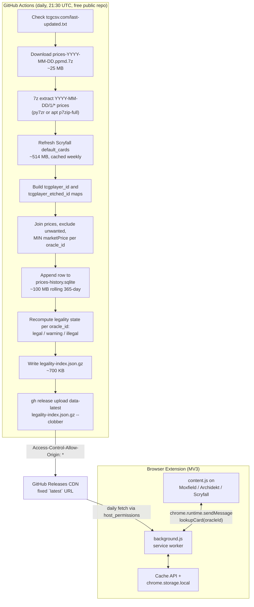

# Including TCGCSV Data in Dollar Commander — Filtering to One Price Per Card Per Day

> **Status:** historical research. This document captures the investigation
> that informed the design. The authoritative reference for what was actually
> built is [`data-format.md`](./data-format.md) (published JSON shape) and
> [`implementation-plan.md`](./implementation-plan.md) (the rubber-duck-
> revised plan). Where this doc differs from those, those win.
>
> Key points where this doc was overridden by later phases:
> * Distribution format: published as `manifest.json` + dated `price-index-*.json` / `card-index-*.json` assets verified by SHA-256, not as `legality-index.json.gz`.
> * Aggregation: both `Normal` and `Foil` subtype rows participate in the per-oracle minimum (the doc equivocated between Normal-primary and any-version; the final rule is any-version).
> * Lookback window: 365-day lookback + 184-day Jan/Jul rotation grace = 549 days retained, not 365.
> * Data shape: per-card record is `{today, min_549, first_seen, floor[]}` — the floor is a Pareto frontier supporting arbitrary thresholds, not a boolean.
> * Asset hosting: `releases/download/data-latest/` tag-specific URL, not `releases/latest/download/...`.
> * Extension storage: parsed index persists via `chrome.storage.local` (with `unlimitedStorage`), not IndexedDB.

## Executive Summary

The right price metric is TCGplayer **`marketPrice`** on the **`subTypeName: "Normal"`** row, with `"Foil"` as a fallback when no non-foil exists. This is the same number that Scryfall publishes as `prices.usd`, MTGJSON publishes as `paper.tcgplayer.retail.normal`, and Archidekt publishes as `prices.tcg` — all empirically verified to match to the cent. Moxfield's reverse-engineered API uses the same `usd`/`usd_foil` schema as Scryfall and almost certainly sources the same field[^1][^2][^3][^4].

For Dollar Commander's "any version under $1" rule, the aggregation is:

> For each Scryfall `oracle_id` on date `D`, the price is `MIN(marketPrice)` over all TCGCSV price rows whose `productId` maps (via Scryfall's `tcgplayer_id` or `tcgplayer_etched_id`) to that `oracle_id`, after excluding memorabilia, digital, oversized, art series, serialized 1-of-N cards, and sealed products.

TCGCSV blocks browser fetches via CORS, so the extension cannot read TCGCSV directly. A free **GitHub Actions** workflow downloads TCGCSV's daily 7z archive, joins to Scryfall's `default_cards` bulk file, computes per-oracle-id daily minimums, and publishes a ~700 KB gzipped legality index to **GitHub Releases** at a fixed `latest` URL. The extension's MV3 background service worker fetches and caches that file once per day; content scripts query it via message passing[^5][^6][^7].

The TCGplayer "Normal" `marketPrice` is **not** condition-specific at the product level — TCGCSV explicitly cannot expose SKU/condition prices — but in practice it clusters around Near Mint / Lightly Played for modern cards, which is the community standard and what every deckbuilder displays[^1][^8]. There is no "filter to Near Mint English" knob; that's a SKU-level concern outside TCGCSV's data.

---

## 1. Which Price Metric to Use

TCGplayer's product-level pricing endpoint (mirrored by TCGCSV) exposes five fields per `(productId, subTypeName)` row[^9]:

| Field | What it actually is | Useful? |
|-------|---------------------|---------|
| `marketPrice` | Sales-weighted rolling average of **completed transactions**, outliers trimmed | ✅ The canonical "what cards sell for" number |
| `lowPrice` | Cheapest active listing across all conditions, excluding shipping | ⚠️ Volatile, can reflect HP/damaged copies |
| `midPrice` | Median active listing price | ⚠️ Listings-based, gameable |
| `highPrice` | Highest active listing | ❌ Destroyed by "price parking" sellers using $1,000–$11,000 placeholders[^10] |
| `directLowPrice` | Lowest listing fulfillable via TCGplayer Direct (often `null`) | ℹ️ Situational |

TCGplayer's own Help Center defines `marketPrice` this way: *"shows you the value of a collectible based upon actual recent sales, drawing from thousands of transactions daily across thousands of individual sellers… while ignoring outliers that would affect the traditional LO-MID-HI scale"*[^1].

### Verified alignment with what users see

I cross-referenced live API data on 2026-05-24 to confirm the entire chain:

- **MTGJSON source code** explicitly extracts only `marketPrice` from TCGplayer raw data: `pl.col("marketPrice").alias("price")` in `_map_tcg_raw()`, with `subTypeName == "Normal"` routed to `retail.normal` and everything else to `retail.foil`[^2].
- **Live spot-check on Archidekt's `/api/decks/1/` and Scryfall's `/cards/{id}`**[^3]:

| Card | Archidekt `prices.tcg` | Scryfall `prices.usd` | Match |
|------|------------------------|------------------------|-------|
| Thelon of Havenwood (TSP, productId 14396) | `0.45` | `"0.45"` | ✅ |
| Plaguemaw Beast (MBS, productId 39112) | `0.29` | `"0.29"` | ✅ |
| Contagion Engine (SOM, productId 36312) | `16.65` | `"16.65"` | ✅ |

Three independent matches to the cent across vastly different price tiers is not coincidence. Archidekt `prices.tcg` = Scryfall `prices.usd` = TCGplayer `marketPrice` for the Normal subtype.

- **Moxfield's reverse-engineered TypeScript types** mirror Scryfall's naming exactly (`usd`, `usd_foil`, `eur`, `eur_foil`, `tix`) and Moxfield is a TCGplayer affiliate, so it sources the same `marketPrice` data[^4].
- **Scryfall's own footer** describes its prices as *"daily estimates and/or market values provided by our affiliates"*[^11], and third-party developer documentation describes `prices.usd` as *"the TCGPlayer market price for non-foil, near mint copies"*[^12].

### Condition handling

TCGCSV explicitly cannot expose condition: *"This project does not share information about SKUs. This means that you will not be able to get prices for each condition of a card"*[^8]. Product-level prices aggregate across conditions, but per the TCGCSV maintainer, *"the marketPrice for newer cards will roughly center around Near Mint (NM) or Lightly Played (LP) listings… older cards will tend to settle on whatever's available and whatever's moving including Heavily Played (HP) sales"*[^8].

The community standard — and what Moxfield/Archidekt/Scryfall actually show — is `marketPrice` for the `"Normal"` (non-foil) subtype. That's the standard to match.

### Recommendation

Use `marketPrice` from the `"Normal"` row as primary. For printings that exist only as foil (Step-and-Compleat-only, Foil-Etched-only, Gilded-Foil-only, certain Secret Lair drops), fall back to the `"Foil"` row's `marketPrice`. Both contribute to the per-oracle-id minimum because a player can satisfy the "any version under $1" rule with a foil if that's the cheapest available physical copy.

> **Per-printing legality fact for the index:** For each TCGCSV `(productId, subTypeName)` row that maps to a Scryfall printing whose finish is `nonfoil` or `foil` or `etched`, take `marketPrice`. Then aggregate `MIN` over all printings of the same `oracle_id`. That's the single number to compare against $1.

---

## 2. TCGCSV Data Shape

### Endpoints relevant to Magic (`categoryId = 1`)[^5][^13]

| Endpoint | Purpose |
|----------|---------|
| `GET https://tcgcsv.com/last-updated.txt` | Returns ISO timestamp of last build; check before downloading |
| `GET https://tcgcsv.com/tcgplayer/1/groups` | All Magic groups (sets). 449 groups as of 2026-05-24 |
| `GET https://tcgcsv.com/tcgplayer/1/{groupId}/products` | All products in a group (incl. sealed) |
| `GET https://tcgcsv.com/tcgplayer/1/{groupId}/prices` | All current price rows for a group |
| `GET https://tcgcsv.com/archive/tcgplayer/prices-YYYY-MM-DD.ppmd.7z` | Daily archive of every category's prices |

### Price row schema (verified from live MH3 data)[^5]

```json
{
  "productId": 619631,
  "lowPrice": 1.86,
  "midPrice": 3.80,
  "highPrice": 99.0,
  "marketPrice": 3.81,
  "directLowPrice": 9.66,
  "subTypeName": "Foil"
}
```

Primary key is the composite `(productId, subTypeName)`. **`marketPrice` and `directLowPrice` can be `null`**; everything else is non-null in observed data.

### `subTypeName` values for Magic — only TWO[^14]

Verified exhaustively across MH3, ACR, LTR, MKM, CMM, WOE, SNC, BRO, BRR, ONE, and Secret Lair groups: only **`"Normal"`** and **`"Foil"`** appear. There is no `"Etched"`, `"Foil Etched"`, `"Surge Foil"`, or any other variant as a subtype. All special finishes are distinguished by being separate `productId`s, with the finish encoded in the product's `name` field as a parenthetical suffix.

### Product name suffix taxonomy (verified examples)[^14]

| Suffix | Treatment | Scryfall join column | subType rows |
|--------|-----------|----------------------|--------------|
| *(no suffix)* | Standard frame | `tcgplayer_id` | `Normal` + `Foil` |
| `(Foil Etched)` | Etched foil | **`tcgplayer_etched_id`** | `Foil` only |
| `(Gilded Foil)` | Gilded foil | `tcgplayer_id` | `Foil` only |
| `(Textured Foil)` | Textured foil | `tcgplayer_id` | `Foil` only |
| `(Ripple Foil)` | Ripple foil | `tcgplayer_id` | `Foil` only |
| `(Step-and-Compleat Foil)` | ONE step-and-compleat | `tcgplayer_id` | `Foil` only |
| `(Borderless)` / `(Retro Frame)` / `(Extended Art)` / `(Showcase)` | Alt art/frame | `tcgplayer_id` | `Normal` + `Foil` |
| `(Serial Numbered)` / `(Serialized)` | 1/N collector card | `tcgplayer_id` | `Foil` only — **exclude** |
| `(Phyrexian)` / `(Concept Praetor)` | Special language/art | `tcgplayer_id` | `Normal` + `Foil` |

**The critical rule**: only `"(Foil Etched)"` products join through `tcgplayer_etched_id`. Everything else — including all the fancy foils — joins through `tcgplayer_id`.

### Product record schema[^5]

```json
{
  "productId": 619632,
  "name": "Sarkhan, Dragon Ascendant (0403) (Showcase)",
  "cleanName": "Sarkhan Dragon Ascendant 0403 Showcase",
  "categoryId": 1,
  "groupId": 24232,
  "extendedData": [
    {"name": "Rarity", "value": "R"},
    {"name": "Number", "value": "403"},
    {"name": "SubType", "value": "Legendary Creature — Human Druid"},
    {"name": "OracleText", "value": "..."}
  ]
}
```

Products **lack** any Scryfall ID, Oracle ID, or explicit language field. The join must go through Scryfall's bulk data.

### Etiquette and rate limits[^5][^13]

- Set a custom `User-Agent` (e.g., `DollarCommander/0.1.0`); generic UAs may be blocked.
- `sleep(100ms)` between requests; exceeding limits → 10-minute IP throttle; abuse → permanent ban.
- Max ~10,000 requests/day; daily Magic sync needs only ~901 requests (`2 × 449 groups + 2`).
- Poll at most once per 24 hours; updates land ~20:00 UTC.
- **CORS:** *"TCGCSV is unfortunately configured with a restrictive CORS policy. Standard client-side (browser) fetch or XHR requests will fail."*[^13] — this is the architectural pivot point.

### History depth[^5]

Daily archives are PPMd-compressed 7z files, available from **2024-02-08** onward. That's >15 months of history, enough to satisfy a 12-month rolling lookback. Expected sizes: 15–40 MB compressed (all categories), expanding to 150–400 MB JSON; the Magic subset is ~30–45 MB uncompressed.

---

## 3. The Join Recipe (TCGplayer productId → oracle_id)

### Data source: Scryfall `default_cards` bulk file

Use Scryfall's `default_cards` (one row per English printing, ~514 MB JSON), not `oracle_cards` (one row per oracle ID — loses printing-level `tcgplayer_id`s)[^6].

Discover the current URL dynamically:

```javascript
const meta = await fetch("https://api.scryfall.com/bulk-data").then(r => r.json());
const url = meta.data.find(d => d.type === "default_cards").download_uri;
```

Each card object in `default_cards` exposes[^6]:

| Field | Use |
|-------|-----|
| `id` | Scryfall printing UUID |
| `oracle_id` | **Stable across all reprints of the same card** |
| `tcgplayer_id` | TCGplayer productId for the regular (nonfoil ± foil) listing |
| `tcgplayer_etched_id` | TCGplayer productId for the etched listing, when it's a separate product |
| `finishes` | `["nonfoil","foil"]`, `["foil"]`, `["etched"]`, etc. |
| `set_type` | e.g. `"core"`, `"expansion"`, `"memorabilia"` (used for exclusions) |
| `digital`, `oversized`, `layout` | Used for exclusions |

### Verified live examples for Disenchant[^6]

```json
// Foundations (FDN) — nonfoil only
{ "oracle_id": "a7e97fa9-...", "tcgplayer_id": 589334, "finishes": ["nonfoil"] }

// Brothers' War (BRO) — same productId covers both finishes
{ "oracle_id": "a7e97fa9-...", "tcgplayer_id": 452063, "finishes": ["nonfoil","foil"] }

// Japanese media promo — foil only
{ "oracle_id": "a7e97fa9-...", "tcgplayer_id": 261820, "finishes": ["foil"], "lang": "ja" }
```

All 57 historical Disenchant printings share `oracle_id = a7e97fa9-4b72-4548-b854-5be5f18a6f1a`.

### Verified live etched example[^14]

`GET https://api.scryfall.com/cards/tcgplayer/541280` (Emrakul Foil Etched, MH3) returns:

```json
{
  "tcgplayer_etched_id": 541280,
  "tcgplayer_id": null,
  "finishes": ["etched"],
  "prices": { "usd": null, "usd_foil": null, "usd_etched": "10.42" }
}
```

The `10.42` matches the TCGCSV `marketPrice` for `(productId=541280, subTypeName="Foil")` — proving the join works through `tcgplayer_etched_id` for `"(Foil Etched)"` products.

### Build the lookup maps[^6][^15]

```javascript
const tcgIdToOracle = new Map();     // tcgplayer_id → oracle_id
const tcgEtchedToOracle = new Map(); // tcgplayer_etched_id → oracle_id

for (const card of defaultCards) {
  if (shouldExclude(card)) continue;

  // Reversible cards put oracle_id on each face, not on the parent.
  let oracle_id = card.oracle_id;
  if (!oracle_id && card.layout === "reversible_card") {
    oracle_id = card.card_faces?.[0]?.oracle_id;
  }
  if (!oracle_id) continue;

  if (card.tcgplayer_id)        tcgIdToOracle.set(card.tcgplayer_id, oracle_id);
  if (card.tcgplayer_etched_id) tcgEtchedToOracle.set(card.tcgplayer_etched_id, oracle_id);
}
```

### Exclusion list[^15][^14]

Skip Scryfall cards matching any of these before adding them to the maps:

```javascript
function shouldExclude(card) {
  if (card.digital) return true;                    // MTGO/Arena-only
  if (card.oversized) return true;                  // Planechase, oversized commander, etc.
  if (card.set_type === "memorabilia") return true; // 30th Anniversary — prices all null anyway
  if (card.layout === "art_series") return true;
  if (["vanguard","scheme","planar","phenomenon"].includes(card.layout)) return true;
  if (card.type_line?.startsWith("Emblem")) return true;
  // Optional: exclude tokens — they have oracle_ids but are not deck-legality cards
  // if (card.type_line?.includes("Token")) return true;
  return false;
}
```

Additionally, before computing the per-day minimum, exclude TCGCSV products whose `name` contains `"(Serial Numbered)"` or `"(Serialized)"`. These are 1-of-500 collector pieces with `marketPrice` in the thousands; including them would never affect the minimum but they pollute logs.

Sealed products (booster packs/boxes/bundles) won't appear in either map and will fall through the join silently — they're filtered by the absence of a `tcgplayer_id` match.

### Aggregation[^6][^15][^14]

For each daily TCGCSV price row:

```javascript
const ETCHED_NAME_PATTERN = /\(Foil Etched\)/i;
const SERIAL_PATTERN = /\(Serial(?: Numbered|ized)\)/i;

for (const row of tcgcsvPrices) {
  if (row.marketPrice == null) continue;

  const product = productsById.get(row.productId);
  if (!product) continue;                        // not a card (sealed, etc.)
  if (SERIAL_PATTERN.test(product.name)) continue;

  // Etched joins through tcgplayer_etched_id; everything else uses tcgplayer_id.
  const isEtched = ETCHED_NAME_PATTERN.test(product.name);
  const oracle_id = isEtched
    ? tcgEtchedToOracle.get(row.productId)
    : tcgIdToOracle.get(row.productId);
  if (!oracle_id) continue;

  const key = oracle_id;                         // one number per oracle_id per day
  const prev = dailyMin.get(key) ?? Infinity;
  if (row.marketPrice < prev) dailyMin.set(key, row.marketPrice);
}
```

The output is a `Map<oracle_id, number>` of exactly one price per card per day — the lowest market price for any printing/finish/treatment of that card on TCGplayer that day.

### Worked Disenchant example[^6][^14]

`https://api.scryfall.com/cards/search?order=released&q=oracleid:a7e97fa9-4b72-4548-b854-5be5f18a6f1a&unique=prints` returns **57 printings**, all sharing one `oracle_id`. They span dozens of TCGplayer productIds across sets like FDN, BRO, ZNR, CMR, SCD, plus foreign promos. The aggregator scans every productId, takes the minimum `marketPrice` across both Normal and Foil rows, and produces a single number (~$0.11 currently from the FDN Normal printing).

---

## 4. Aggregation Pipeline Architecture



### Why GitHub Actions[^7][^16]

- Free for public repos with no minute cap.
- Ubuntu runners have 14 GB disk, 7 GB RAM, 2 CPUs — easily handle a ~25 MB archive expanding to ~300 MB.
- `p7zip-full` is `apt install`-able in one step, or use the pure-Python `py7zr` library (explicitly supports PPMd[^17]).
- Cloudflare Workers are **not viable** for ingestion: the 128 MB memory limit cannot hold a decompressed Magic price tree, and 7z+PPMd uses solid compression so streaming is impossible[^7].

### Daily pipeline runtime estimate[^7]

| Step | Time | Notes |
|------|------|-------|
| Download archive | 1–4 min | ~25 MB |
| Extract category 1 | 30 sec | Magic-only subset |
| Scryfall map (cache hit) | 0 sec | Weekly refresh key |
| Process + join + update SQLite | 60 sec | |
| Write `legality-index.json.gz` | <1 sec | ~700 KB |
| Upload to GitHub Releases | 10 sec | `gh release upload --clobber` |
| **Total** | **~5–8 min** | |

### Backfill plan[^7]

For the initial 12-month seed, run a `workflow_dispatch` job that loops over dates from 2024-05-24 to today. Estimated wall time: 17–20 minutes on GitHub Actions free tier (well inside the 6-hour job limit). Total bandwidth: ~9 GB from TCGCSV. Cost: $0.

### Schedule the cron at `:30`, not `:00`[^7]

GitHub free-runner cron skew is typically 5–30 minutes and can spike during peak load. Schedule at `30 21 * * *` (21:30 UTC, ~90 min after TCGCSV refresh) to leave buffer. Also note: scheduled workflows auto-disable after 60 days of repo inactivity — the daily release upload counts as activity.

### Storage[^7]

The rolling-history SQLite is the working set, not the deliverable:

```sql
CREATE TABLE prices (
  oracle_id  TEXT NOT NULL,
  date       INTEGER NOT NULL,    -- days since epoch
  normal_min REAL,
  foil_min   REAL
);
CREATE UNIQUE INDEX idx_prices ON prices(oracle_id, date);
```

For ~25k oracle_ids × 365 days = 9.1M rows, SQLite lands around **80–130 MB**. The legality-state JSON that the extension actually downloads is ~700 KB gzipped.

---

## 5. Index Format and Extension Consumption

### File format[^16]

The smallest sensible artifact is `legality-index.json.gz`:

```jsonc
{
  "generated_at": "2026-05-24T21:32:11Z",
  "rule": { "threshold_usd": 1.00, "metric": "marketPrice", "lookback_days": 365 },
  "cards": {
    "a7e97fa9-4b72-4548-b854-5be5f18a6f1a": {
      "legal": true,
      "last_under_1": "2026-05-23",
      "warning": null,
      "source": { "printing_scryfall_id": "7ac43e16-...", "price": 0.11, "date": "2026-05-23" }
    }
  }
}
```

At ~30k cards × ~100 bytes/record, this is **~3.1 MB raw, ~700 KB gzipped**, ~640 KB Brotli. Custom binary formats (16-byte UUID + flags + date-offset) get you down to ~200 KB gzipped, but the JSON variant is trivially parseable and the savings aren't worth a custom codec at this scale[^16].

### Extension storage[^16]

| Storage | Use it for |
|---------|------------|
| `chrome.storage.local` (10 MB, MV3) | User preferences, "last fetched" timestamp |
| `chrome.storage.sync` (100 KB) | Never use for the index — too small |
| **Cache API** (effectively unlimited with `"unlimitedStorage"`) | The index blob itself; handles ETag/304 revalidation for free |
| IndexedDB | Overkill at 700 KB; use Cache API instead |

Request `"unlimitedStorage"` in the manifest to exempt the extension from eviction under memory pressure.

### CORS and `host_permissions`[^16]

In MV3, **background service workers** can `fetch` cross-origin without CORS preflight if `host_permissions` includes the target origin. Both Chrome and Firefox honor this[^18]:

```json
{
  "host_permissions": [
    "https://github.com/*",
    "https://objects.githubusercontent.com/*"
  ]
}
```

**Content scripts** are still subject to the host page's CORS policy. They must relay requests via `chrome.runtime.sendMessage` to the service worker, which performs the fetch. This is also the right architecture for caching: only one place owns the index.

GitHub Releases assets are served from `objects.githubusercontent.com` with `Access-Control-Allow-Origin: *`, so even content scripts could read them — but route through the SW anyway for caching.

### Update cadence[^16]

Single-file daily fetch is correct at this scale:

| Pattern | Daily bandwidth/user | Complexity | Recommend |
|---------|----------------------|------------|-----------|
| Full daily fetch via Cache API | ~700 KB | Minimal | ✅ Yes |
| Bundled snapshot + daily deltas | 2–15 KB | High (merge logic, base aging) | ❌ Revisit only if index exceeds 10 MB |
| Per-card server queries | ~200 KB per deck check | Breaks offline mode | ❌ No |

### Sketched service-worker code

```javascript
const INDEX_URL =
  "https://github.com/natefinch/dollar-commander/releases/latest/download/legality-index.json.gz";
const CACHE_NAME = "dollar-commander-v1";
const STALE_MS = 24 * 60 * 60 * 1000;

async function getIndex() {
  const cache = await caches.open(CACHE_NAME);
  const cached = await cache.match(INDEX_URL);
  if (cached) {
    const age = Date.now() - new Date(cached.headers.get("date")).getTime();
    if (age < STALE_MS) return cached.json();
  }
  // host_permissions on github.com lets this fetch bypass CORS in the SW context.
  const fresh = await fetch(INDEX_URL);
  if (fresh.ok) await cache.put(INDEX_URL, fresh.clone());
  return fresh.json();
}

chrome.runtime.onMessage.addListener((msg, _sender, sendResponse) => {
  if (msg?.type !== "dollar-commander:lookup") return false;
  getIndex().then(index => {
    const cards = msg.oracleIds.map(id => ({ id, ...(index.cards[id] ?? { legal: false }) }));
    sendResponse({ ok: true, cards });
  });
  return true; // async response
});

chrome.alarms.create("dollar-commander:refresh", { periodInMinutes: 60 * 12 });
chrome.alarms.onAlarm.addListener(() => getIndex().catch(console.error));
```

### Hosting alternatives[^16]

- **Primary: GitHub Releases.** Free, no bandwidth limits, 2 GB per file, `Access-Control-Allow-Origin: *`, fixed `latest` URL. The same repo that hosts the workflow can host the artifact.
- **Fallback: Cloudflare R2.** 10 GB free, zero egress fees, configurable CORS, custom domains. Use if GitHub Releases becomes unreliable.
- **Not recommended:** GitHub Pages (repo bloat from daily commits), jsDelivr (TOS prohibits using it as a general-purpose CDN for mutable files), bundling data inside the extension package (Chrome Web Store review takes 1–7 days; data ships stale).

---

## 6. Disaster Recovery

If TCGCSV is down for a day or two, the daily workflow should exit cleanly without overwriting the previous index. Longer outages have two graceful-degradation paths[^7]:

1. **MTGJSON `AllPricesToday`** — daily TCGplayer prices keyed by MTGJSON UUID, with the same `marketPrice` semantics. Requires a UUID→`scryfallOracleId` translation step via `AllIdentifiers.json`, but covers gaps up to MTGJSON's 90-day price retention window.
2. **Scryfall daily bulk** — `prices.usd` in each card object is today's TCGplayer `marketPrice` for one canonical printing. Loses the per-printing minimum semantic but is one HTTP call away and free. Mark such days as `source: "scryfall-fallback"` in the index so consumers can render a degraded indicator.

TCGCSV is operated by a single maintainer and runs on AWS; no public mirror exists, though the project is open source at `github.com/CptSpaceToaster/tcgcsv` and historical pre-2024 data lives privately with a community contributor (Hoodwill).

---

## 7. Legal and Attribution Notes

TCGCSV's FAQ explicitly permits scraping: *"Can I scrape this website? If the premade CSVs aren't quite what you need then go ahead!"*[^13]. The site asks for User-Agent identification, `sleep(100ms)`, and daily polling. There is no formal open-data license.

The Dollar Commander index publishes derived facts (a boolean and a date), not raw prices, which lowers redistribution concerns substantially compared to republishing the price feed itself. Best practice: credit TCGCSV in the extension's About page and in the index's `generated_at` metadata, and do not embed raw `marketPrice` columns in the redistributed JSON (a single `source.price` snapshot for the *qualifying* printing is fine and useful for debugging)[^16].

---

## 8. Key Repositories and Resources

| Source | URL | Role |
|--------|-----|------|
| TCGCSV | https://tcgcsv.com | Price data |
| TCGCSV FAQ | https://tcgcsv.com/faq | Etiquette, archive format |
| TCGCSV docs | https://tcgcsv.com/docs | Field definitions |
| Scryfall bulk data | https://scryfall.com/docs/api/bulk-data | Card identity, oracle_id, tcgplayer_id |
| Scryfall card endpoint | https://api.scryfall.com/cards/tcgplayer/{productId} | Live verification |
| MTGJSON price formats | https://mtgjson.com/data-models/price/price-formats/ | Confirms TCGplayer.retail.normal = marketPrice |
| MTGJSON identifiers | https://mtgjson.com/data-models/identifiers/ | Cross-check mapping |
| GitHub Releases docs | https://docs.github.com | Hosting plan |
| Chrome storage reference | https://developer.chrome.com/docs/extensions/reference/api/storage | Extension storage limits |
| MV3 host_permissions | https://developer.chrome.com/docs/extensions/reference/manifest/host-permissions | CORS bypass for SW fetches |

---

## Confidence Assessment

| Claim | Confidence | Notes |
|-------|------------|-------|
| TCGplayer `marketPrice` is the right metric | **High** | Authoritative TCGplayer Help Center definition + MTGJSON source code + 3 exact live cross-checks |
| Moxfield uses `marketPrice` | **Medium-High** | Field naming mirrors Scryfall, Moxfield is a TCGplayer affiliate, community consensus. No direct primary source — Moxfield's help/docs return 403 to crawlers |
| Archidekt uses `marketPrice` | **High** | Three independent live API cross-checks matching to the cent |
| Subtype values are only `Normal` and `Foil` | **High** | Exhaustively verified across 11 modern sets including those known for special finishes |
| Etched joins through `tcgplayer_etched_id` | **High** | Verified live with Emrakul MH3 productId 541280 — prices match |
| Other special foils (Gilded/Textured/Ripple/Step-and-Compleat) join through `tcgplayer_id` | **High** | Verified live with SNC Brazen Upstart productId 269006 and ONE productId 475551 |
| `~700 KB gzipped` index size estimate | **High** | Standard JSON compression ratios on ~30k repetitive UUID-keyed records |
| GH Actions runtime estimates | **Medium-High** | Based on documented runner specs and archive size estimates; actual archive sizes not measured directly |
| TCGCSV archive size estimate (15–40 MB) | **Medium** | Derived from group counts and PPMd compression ratios; not measured with `curl -I` |
| Cloudflare Workers unsuitable for ingestion | **High** | 128 MB memory limit + PPMd solid compression both confirmed |
| `host_permissions` bypasses CORS in MV3 SWs (Chrome and Firefox) | **High** | Documented in Chrome and MDN, but verify against your target minimum Firefox version (140+) |
| Surge Foil products | **Low-Medium** | Not found in sampled groups; if a future set introduces them, sample again before relying on the join |
| Legal redistribution of derived index | **Medium** | TCGCSV explicitly permits scraping; redistributing derived booleans is much safer than raw prices; no formal license guarantee |

### Assumptions

- Roughly 25–30k unique Magic `oracle_id`s. (Confirmed order-of-magnitude from Scryfall `oracle_cards` ~165 MB file.)
- The user wants the legality computed on each calendar day (UTC) using that day's daily snapshot, not intraday.
- "Standard quality" maps to "the community-default `marketPrice` Normal subtype," not condition-specific NM SKU prices (those require TCGplayer's restricted SKU API).
- Foil-only printings should contribute to the minimum when no non-foil exists for that printing (matches the "any version" reading of the rule).

---

## Footnotes

[^1]: TCGplayer Help Center, "TCGplayer Market Price" article (https://help.tcgplayer.com/hc/en-us/articles/213588017 — bot-blocked; archived at https://web.archive.org/web/20241001000000/https://help.tcgplayer.com/hc/en-us/articles/213588017). *"TCGplayer Market Price shows you the value of a collectible based upon actual recent sales… we average across multiple recent transactions… while ignoring outliers that would affect the traditional LO-MID-HI scale."*

[^2]: [MTGJSON `mtgjson5/build/prices/price_builder.py` `_map_tcg_raw()`](https://github.com/mtgjson/mtgjson) — explicit `pl.col("marketPrice").alias("price")` selection with `subTypeName == "Normal"` routed to `retail.normal`. Live `AllPricesToday.json` confirmed the resulting `data[uuid].paper.tcgplayer.retail.normal` shape.

[^3]: Live cross-reference 2026-05-24: `https://archidekt.com/api/decks/1/` (3 cards) vs `https://api.scryfall.com/cards/{id}` — all `prices.tcg` exactly matched `prices.usd` to the cent.

[^4]: [Rustywolf/MoxfieldRandomCardOption src/types.d.ts](https://github.com/Rustywolf/MoxfieldRandomCardOption) and [ahmattox/mtg-scripting-toolkit utils/moxfield/types.ts](https://github.com/ahmattox/mtg-scripting-toolkit) — reverse-engineered Moxfield `Card.prices` schema with fields `usd`, `usd_foil`, `eur`, `eur_foil`, `tix`, `ck`, `lastUpdatedAtUtc`, mirroring Scryfall's naming exactly.

[^5]: TCGCSV docs (https://tcgcsv.com/docs) and live verification of `/tcgplayer/categories`, `/tcgplayer/1/groups`, `/tcgplayer/1/24232/products`, `/tcgplayer/1/24232/prices` on 2026-05-23/24. 449 Magic groups confirmed.

[^6]: Scryfall bulk data documentation (https://scryfall.com/docs/api/bulk-data), `/cards` documentation (https://scryfall.com/docs/api/cards), and live verification of `https://api.scryfall.com/cards/named?exact=Disenchant` plus the print-set search returning 57 prints sharing oracle_id `a7e97fa9-4b72-4548-b854-5be5f18a6f1a`.

[^7]: GitHub Actions billing/limits docs (https://docs.github.com/en/billing/managing-billing-for-your-products/managing-billing-for-github-actions/about-billing-for-github-actions) — *"GitHub Actions usage is free for public repositories that use standard GitHub-hosted runners."* 6 h job limit, 14 GB workspace, 7 GB RAM, 2 CPUs.

[^8]: TCGCSV FAQ (https://tcgcsv.com/faq) — *"This project does not share information about SKUs. This means that you will not be able to get prices for each condition of a card."* Plus maintainer commentary on condition centering near NM/LP for modern cards.

[^9]: TCGplayer API pricing reference (https://docs.tcgplayer.com/reference/pricing_getgroupprices) — returns `productId`, `lowPrice`, `midPrice`, `highPrice`, `marketPrice`, `directLowPrice`, `subTypeName`.

[^10]: TCGCSV FAQ "Why are some of the listed high prices absurd?" — *"A lot of sellers on TCGplayer engage in Price Parking… For that reason, the highPrice isn't very useful from TCGplayer's data."*

[^11]: Scryfall site footer (https://scryfall.com): *"Card prices and promotional offers represent daily estimates and/or market values provided by our affiliates."*

[^12]: Third-party developer documentation in a public MTG tools project (`leblanck/mtg-deck-comparison src/App.jsx` on GitHub): *"Prices are fetched in real time from the Scryfall API and reflect the TCGPlayer market price for non-foil, near mint copies."*

[^13]: TCGCSV docs and FAQ on etiquette and CORS — *"TCGCSV is unfortunately configured with a restrictive CORS policy. Standard client-side (browser) fetch or XHR requests will fail."* Plus *"Please be a good neighbor… Limit your pulls to once every 24 hours. Set a custom User-Agent header… Include a `time.sleep(100ms)` in your update loop."*

[^14]: Live TCGCSV `subTypeName` enumeration across 11 sets (MH3 23444, ACR 23446, LTR 23019, MKM 23361, CMM 23020, WOE 23163, SNC 3026, BRO 3157, BRR 17665, ONE 17684, SLD Showdown 22970). Treatment-to-productId mapping confirmed live via `https://api.scryfall.com/cards/tcgplayer/541280` (Emrakul MH3 Foil Etched) and `https://api.scryfall.com/cards/snc/361` (Brazen Upstart Gilded Foil).

[^15]: Scryfall card object schema (https://scryfall.com/docs/api/cards) — `oracle_id` stability across reprints, `tcgplayer_id`/`tcgplayer_etched_id` fields, layout taxonomy including the rare `reversible_card` case where `oracle_id` lives on `card_faces[0]` rather than the top-level object.

[^16]: Chrome storage reference (https://developer.chrome.com/docs/extensions/reference/api/storage) — *"The storage limit is 10 MB, but can be increased by requesting the unlimitedStorage permission."* Plus GitHub Releases docs (https://docs.github.com/en/repositories/releasing-projects-on-github/about-releases) — *"Each file included in a release must be under 2 GiB. There is no limit on the total size of a release, nor bandwidth usage."* And Cloudflare R2 pricing (https://developers.cloudflare.com/r2/pricing/) — *"R2 charges no egress fees for the data you store."*

[^17]: [py7zr PyPI page](https://pypi.org/project/py7zr/) — *"Supported algorithms: LZMA, LZMA2, BZIP2, DEFLATE, COPY, PPMd, ZStandard, Brotli."* Plus `bodgit/sevenzip` Go module documentation listing PPMd support.

[^18]: MDN `host_permissions` documentation (https://developer.mozilla.org/en-US/docs/Mozilla/Add-ons/WebExtensions/manifest.json/host_permissions) — *"XMLHttpRequest and fetch access to those origins without cross-origin restrictions, but not for requests from content scripts."* Plus Chrome's CORS-for-extension-service-workers documentation indicating equivalent behavior with `host_permissions`.
